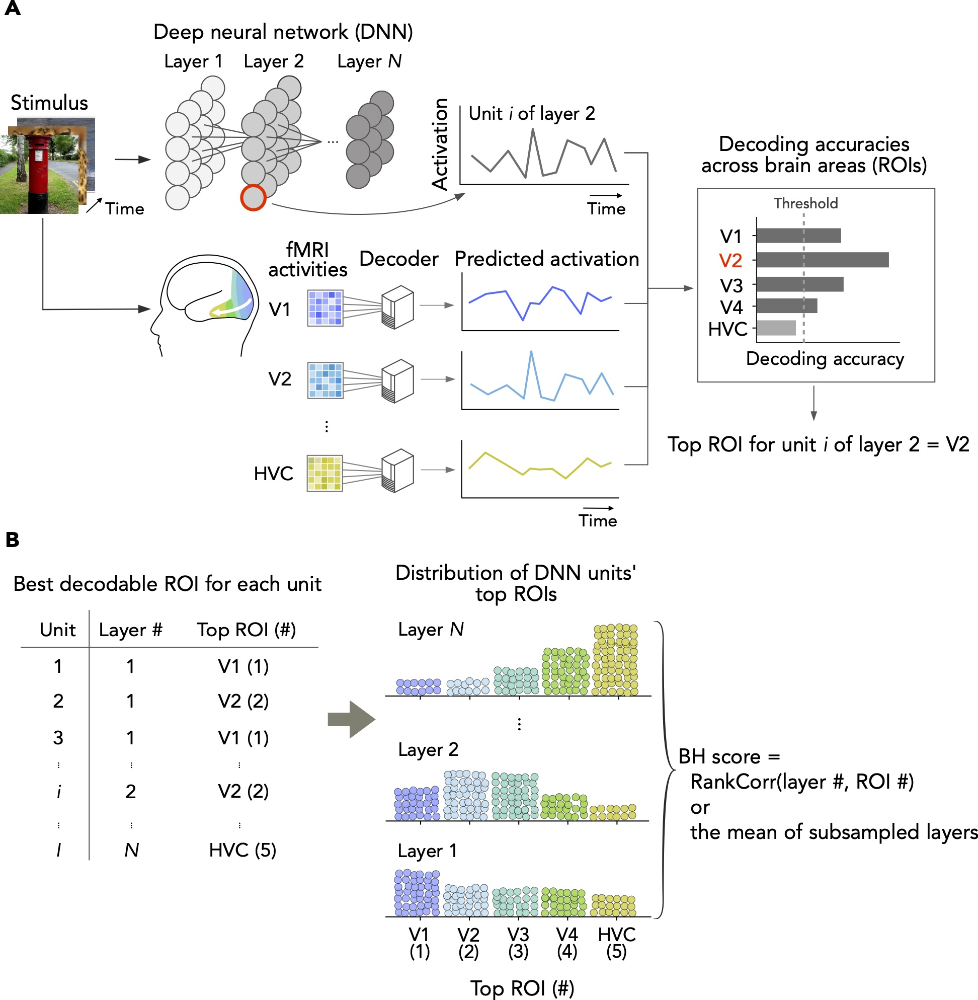

# Brain Hierarchy Score

<p align="center">

</p>

This repository contains code and data to reproduce the main results of [Nonaka, Majima, Aoki, and Kamitani (2021) Brain hierarchy score: Which deep neural networks are hierarchically brain-like? *iScience*](http://dx.doi.org/10.1016/j.isci.2021.103013).

## Requirements

* Python
* [BdPy](https://github.com/KamitaniLab/bdpy)
* [PyFastL2LiR](https://github.com/KamitaniLab/PyFastL2LiR)
* NumPy
* SciPy
* Pillow
* hdf5storage
* PyTorch, Caffe or TensorFlow

## Data

### fMRI data

We used fMRI data collected in [Shen, Horikawa, Majima, and Kamitani (2019) Deep image reconstruction from human brain activity. PLOS Comput Biol](https://journals.plos.org/ploscompbiol/article?id=10.1371/journal.pcbi.1006633).
To download fMRI data (about 2.4 GB in total), run `data/download_fmri.sh`.
You can also download fMRI data manually from [figshare](https://figshare.com/articles/Deep_Image_Reconstruction/7033577) (see [data/fmri/README.md](data/fmri/README.md) for details).
All fMRI data should be placed in`data/fmri_data`.

### Stimulus images

Natural images selected from the ILSVRC2012 dataset were used in our study.
For copyright reasons, we do not distribute the images.
You can request us the images via <https://forms.gle/ujvA34948Xg49jdn9>.

### DNN unit activations to the stimulus images

Unit activations of DNNs to the stimulus images are provided at [figshare](https://figshare.com/articles/dataset/The_Brain_Hierarchy_Score/12401168).
You can download the files (about 6.8 GB in total) with `data/download_features.sh` script.

### Decoding and encoding accuracy

Decoding and encoding accuracy used to calculate the BH score is shared at [figshare](https://figshare.com/articles/dataset/The_Brain_Hierarchy_Score/12401168).
You can download them with `data/download_decoding_accuracy.sh` and `data/download_encoding_accuracy.sh`.

## Reproducing the results of Nonaka et al. (2021)

1. Download decoding and encoding accuracy data (run `data/download_decoding_accuracy.sh` and `data/download_encoding_accuracy.sh` in `data` directory).
2. Run `calc_bhscore.ipynb`. The code will calculate decoding-based, encoding-based, and averaged BH scores of 29 DNNs, and then display the averaged BH scores (Figure 3).

## Gettting a BH score of your DNN (decoding-based)

### 1. Get stimulus images

See "Data/Stimulus images".

### 2. Extract unit activation of the DNN to the stimulus images.

Here you need to obtain unit activation of the DNN to stimulus images.
The DNN unit activation should be saved in `data/features` directory.
The data should be organized as below.

```
features/
├── ImageNetTraining/
│    └── <framework (e.g., caffe, pytorhc, tensorflow, ...)
│          └── <network>
│                ├── <layer 1>
│                │     ├── n01518878_10042.mat
│                │     ├── n01518878_12028.mat
│                │     ...
│                │     └── n13111881_9170.mat
│                ├── <layer 2>
│                ...
│                └── <layer N>
│
└── ImgeNetTest/
      └── <framework (e.g., caffe, pytorhc, tensorflow, ...)
            └── <network>
                  ├── <layer 1>
                  │     ├── n01443537_22563.mat
                  │     ├── n01621127_19020.mat
                  │     ...
                  │     └── n04572121_3262.mat
                  ├── <layer 2>
                  ...
                  └── <layer N>
```

Each mat file contains unit activation to an image (e.g., "n01518878_10042") in the layer/DNN.
The activation is saved as an array named `feat` that has shape of 1 x num units in the mat files.

We provide scripts used to obtain unit activation in our analysis at `feature_extraction`.
You can modify settings in `feature_extraction/extract_features_(caffe | pytorch).py` based on your DNN and run the script to obtain the unit activations.

```
cd feature_extraction
python extract_features_caffe.py (or feature_extraction/extract_features_pytorch.py)
```

*Optional*: If you want to extract features in a part of layers, please modify settings in the script.

We recommend <https://github.com/tomrunia/TF_FeatureExtraction> to extract features from Tensorflow models.

### 3. Decoding of DNN unit activation.

``` shell
$ python feature_decoding_train.py --net <framework>/<network>
$ python feature_decoding_predict.py --net <framework>/<network>
```

You can run the script in parallel across different computers when they share the same working directory.

The results of decoding analysis are saved in `data` directory.

- `data/feature_decoders`: trained decoders
- `data/decoded_features`: decoded DNN unit activations
- `data/decoding_accuracy`: decoding accuracies

To speed up the computation, run the script parallelly. 

### 4. Calculate BH score

To compute BH score, first add information about your DNN in `settings.json` as below.

```
{
    "subjects": ["sub-01", "sub-02", "sub-03"] ,
    "rois": ["V1", "V2", "V3", "V4", "HVC"],
    "dnns": {
        "<Name of the DNN>": {
            "dir": "caffe/AlexNet",
            "layers": [<layers in order of the hierarchy (e.g., "conv1_abs", "conv2", "conv3", "conv4", "conv5", "fc6", "fc7", "fc8")>]
        },
        ...
```

Then, run `calc_bhscore.ipynb` and you will get the BH score for your DNN.

## Misc

* If your caffe prototxt file uses in-place computation, use feature_extraction/modify_layer_name.py to access activations of intermidiate layers. 
